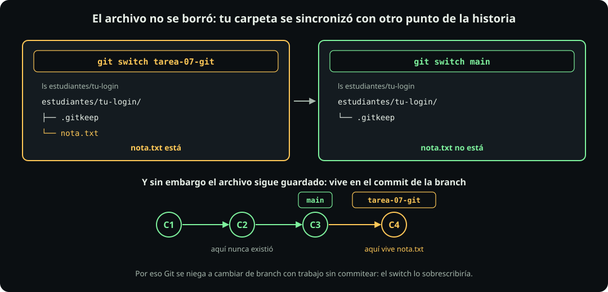

# Branches, en serio

**GitHub · página 3 de 6** · 35 min

Meta: que crear, cambiar y borrar branches deje de dar miedo, porque el resto del curso se entrega desde una.

## En corto

- Ya sabes que una branch es **una etiqueta que apunta a un commit**. Aquí ves qué te hace *en el disco*.
- `git switch` **reescribe los archivos de tu carpeta** para que coincidan con la branch a la que llegas.
- Una branch por tarea no es burocracia: mantiene tu `main` limpio para la semana siguiente.
- Una branch nacida de un `main` atrasado arrastra basura a tu pull request. Se rescata con un comando.
- Y resolver un conflicto es **editar el archivo y borrar los marcadores**. Git no comprueba que lo hayas hecho.

Todo lo de esta página se hace en el repositorio de verdad, dentro de tu carpeta. Al final se limpia.

---

## 1 · La branch cambia lo que ves

::: figure {#git-branch-disco title="Cambiar de branch reescribe tu carpeta"}

:::

```bash
cd ~/fdd/fdd_o26
echo "$U"                    # si sale vacío, redefínela
git switch main              # arranca siempre desde main
git switch -c practica-a     # -c = create: créala Y muévete
git branch --show-current    # → practica-a

echo "escrito en practica-a" > estudiantes/$U/nota.txt
git add estudiantes/$U/nota.txt   # por ruta, nunca "."
git commit -m "practica: nota en la branch a"
ls estudiantes/$U            # nota.txt está

git switch main
ls estudiantes/$U            # NO está  ← lo importante

git switch practica-a
ls estudiantes/$U            # volvió
```

```text
git switch -c practica-a
       │    │      └── el nombre, lo pones tú
       │    └───────── -c: créala si no existe
       └────────────── cámbiate de branch, y ajusta el disco
```

**No se borró.** Sigue guardado en el commit de `practica-a`. Lo que hizo `switch` fue poner en tu carpeta el contenido que corresponde a `main`, y en `main` ese archivo nunca existió.

> Una branch no es una carpeta ni una copia. Es un punto de la historia, y `git switch` **sincroniza tu carpeta con ese punto**.

> [!WARNING]
> Con cambios sin commitear, Git se niega a cambiar de branch: `Your local changes would be overwritten`. No te regaña, te avisa de que el switch los borraría. Salidas: `git commit` o `git stash`.

---

## 2 · Dos branches, el mismo archivo

```bash
git switch main          # las dos nacen del MISMO punto
git switch -c practica-b
echo "escrito en practica-b" > estudiantes/$U/nota.txt
git add estudiantes/$U/nota.txt
git commit -m "practica: nota en la branch b"

git merge practica-a     # tráela a la branch donde estás
```

**Deberías ver:**

```text
CONFLICT (content): Merge conflict in
  estudiantes/tu-login/nota.txt
Automatic merge failed; fix conflicts and then commit.
```

### Qué le pasó a tu archivo

```bash
git status                      # both modified: nota.txt
cat estudiantes/$U/nota.txt
```

Git **no borró nada**: metió las dos versiones en el mismo archivo, separadas por tres líneas marcadoras.

```text
<<<<<<< HEAD
escrito en practica-b
=======
escrito en practica-a
>>>>>>> practica-a
```

::: table {#git-marcadores title="Las tres líneas que Git inserta"}

| Línea | Qué marca |
|---|---|
| `<<<<<<< HEAD` | aquí empieza **tu** versión, la de la branch donde estás |
| `=======` | aquí acaba la tuya y empieza la otra |
| `>>>>>>> practica-a` | aquí acaba la de la branch que mergeaste, y dice cuál es |

:::

> **Resolver el conflicto son dos cosas, y las dos son obligatorias:**
> 1. Dejar el archivo con el contenido que quieres.
> 2. **Borrar las tres líneas marcadoras.**

Nadie te obliga a escoger un lado. Puedes quedarte con una mitad, con la otra, con las dos, o escribir algo nuevo. Git no opina: sólo se niega a decidir por ti.

### Paso 1: edítalo con un editor

Aquí **no** sirve `echo` ni `printf`: sobrescriben el archivo entero, y en un archivo de verdad tienes que conservar todo lo que no está en conflicto. Ábrelo:

```bash
nano estudiantes/$U/nota.txt
```

Digamos que quieres quedarte con las dos frases. **Borra las tres líneas marcadoras** y deja el archivo exactamente así:

```text
escrito en practica-b
escrito en practica-a
```

En `nano` se guarda con `Ctrl+O`, Enter, y se sale con `Ctrl+X`. Si prefieres VS Code, `code estudiantes/$U/nota.txt` te muestra botones de *Accept Current* / *Accept Incoming* que hacen lo mismo por ti.

### Paso 2: comprueba que no quedó ningún marcador

Éste es el paso que casi nadie hace, y el que evita el error de la advertencia de abajo:

```bash
cat estudiantes/$U/nota.txt              # míralo con tus ojos
grep -c '^[<=>]\{7\}' estudiantes/$U/nota.txt
```

El `grep` **tiene que decir `0`**. Ese patrón —una línea que empieza con siete `<`, `=` o `>`— es de la [[expresiones-regulares|unidad pasada]], y busca exactamente las tres líneas que Git insertó.

> [!WARNING]
> **Si dejas un marcador, Git lo commitea sin decirte nada.** No hay advertencia, no hay error: tu archivo se queda con un `<<<<<<< HEAD` dentro para siempre, y lo descubres semanas después cuando el código no corre. Por eso se comprueba, y no se confía.

### Paso 3: cierra el merge

```bash
# add = "ya lo revisé, ésta es la buena"
git add estudiantes/$U/nota.txt
git status                        # All conflicts fixed
git commit -m "practica: resuelvo el conflicto"
```

Aquí `git add` significa algo distinto de lo habitual: no es "apartar para el próximo commit", es **"ya lo resolví"**. Por eso el conflicto se cierra con el mismo comando que usas para todo lo demás.

### Si te arrepientes: la salida de emergencia

```bash
git merge --abort
```

Deja todo exactamente como estaba antes de intentar el merge, marcadores incluidos. **Sólo funciona mientras el merge sigue abierto**: una vez que hiciste el `commit` del paso 3, ya no hay nada que abortar.


Lo que acabas de provocarte a solas es exactamente lo que pasa cuando dos personas tocan el mismo archivo. La mecánica es idéntica; lo único que cambia es que del otro lado hay alguien más. Por eso conviene romperlo aquí primero.

> [!NOTE]
> Un conflicto no es un error. Es Git negándose a inventar. La única forma de que nunca aparezca es que dos personas no toquen las mismas líneas, y de ahí sale la regla de la página 4.

---

## 3 · La branch atrasada, que es la que rompe entregas

::: figure {#git-branch-atrasada title="Una branch nacida de un main viejo"}

:::

Éste es el error más caro del semestre y **no da ningún mensaje**. Simúlalo:

```bash
git switch main
git switch -c practica-atrasada   # nace del main de ahorita
git switch main

# simula que el curso avanzó mientras trabajabas
echo "avance del curso" > estudiantes/$U/simulacion.txt
git add estudiantes/$U/simulacion.txt
git commit -m "practica: simulo que el curso avanzó"

git switch practica-atrasada

# el comando que lo DIAGNOSTICA
git log --oneline practica-atrasada..main

# el RESCATE, un solo comando
git merge main

# ahora la lista sale vacía
git log --oneline practica-atrasada..main
```

```text
git log --oneline practica-atrasada..main
                  │                  └── ...hasta este otro
                  └──────────────── qué le falta a éste...
```

**Si esa lista no está vacía, tu branch nació atrasada.**

Por qué importa: el pull request **no compara tu branch contra el curso de hoy**, sino contra el punto donde las dos historias se separaron.

Si tu branch nació de un `main` de hace dos semanas, GitHub muestra como diferencia tuya todo lo que publiqué en esas dos semanas. Tú no lo escribiste. Pero desde fuera tu propuesta dice *"revierte esos nueve archivos"*.

Por eso el flujo empieza por ponerse al día, y no a la mitad.

---

## Limpieza

```bash
git switch main
git fetch upstream
git reset --hard upstream/main  # tira los commits de práctica
git branch -D practica-a practica-b practica-atrasada
git branch                      # sólo main
git status                      # limpio
```

> [!WARNING]
> `git reset --hard` **descarta trabajo sin preguntar**. Aquí es seguro porque tu `main` local sólo tiene los commits de práctica. Fuera de este contexto, léelo dos veces.

## El ciclo de vida de una branch

::: table {#git-branch-cuando title="Cuándo se crea, cuándo se borra"}

| Momento | Comando | Qué hace |
|---|---|---|
| Empiezas una tarea | `git switch -c tarea-07-git` | La crea desde donde estás. **Párate en `main` actualizado** |
| Te mueves | `git switch <nombre>` | Reescribe tu carpeta con el contenido de esa branch |
| No sabes dónde estás | `git branch --show-current` | Imprime el nombre. Cuesta cero, úsalo |
| Nació atrasada | `git merge main` | Le trae lo que le faltaba |
| Ya te mergearon el PR | `git branch -d tarea-07-git` | La borra **sólo si ya está mergeada** |
| Era práctica, tírala | `git branch -D practica-a` | La borra aunque tenga trabajo sin mergear |

:::

`-d` **se niega** si la branch tiene commits que no están en ningún lado. Esa negativa es una protección: cuando aparece hay que leerla, no escalarla a `-D`.

## Cómo se llaman en este curso

```text
tarea-07-git      tarea-08-python      tarea-09-sql
```

Sin espacios, sin acentos, en minúsculas. Y **nunca se entrega desde `main`**: un pull request que sale de tu `main` se rechaza automáticamente.

::: problem {#git-p9-branch title="Cambié de branch y mi archivo desapareció"}
Una compañera trabajó toda la tarde en `tarea-07-git`, dejó el archivo terminado, y sin hacer commit se cambió a `main` para revisar una cosa. Git no la dejó: le dijo `Your local changes would be overwritten by checkout`.

Ella entendió que su trabajo estaba en peligro, así que borró el archivo para poder cambiarse. Después regresó a `tarea-07-git` y el archivo, obviamente, ya no estaba.

¿Qué debió haber hecho, y qué le habría pasado si el mensaje no hubiera aparecido?
:::

::: hint {of="git-p9-branch"}
El mensaje no era una advertencia sobre el pasado. Era una advertencia sobre lo que estaba a punto de ocurrir.
:::

::: answer {of="git-p9-branch"}
Debió hacer `git commit`, si el trabajo estaba listo, o `git stash`, si quería apartarlo y recuperarlo con `git stash pop` al volver.

Lo importante es leer el mensaje al derecho. `Your local changes would be overwritten` no dice "tu trabajo está en peligro": dice **"si me dejas cambiar de branch, voy a sobrescribir esto"**. Git se niega justamente para no perderlo, igual que `git branch -d`.

Si hubiera hecho commit antes, el cambio de branch habría hecho lo de la primera parte de esta página: el archivo habría desaparecido del listado en `main` y habría vuelto al regresar. **Desaparecer del `ls` y desaparecer de la historia son cosas distintas**, y confundirlas es lo que la llevó a borrarlo.

Moraleja doble: commit antes de cambiar de branch, y cuando Git se niegue a algo, la respuesta casi nunca es forzarlo.
:::

> [!NOTE]
> **Si sólo recuerdas una cosa:** una branch por tarea, nacida de un `main` recién actualizado. Si `git log --oneline tu-branch..main` no sale vacío, tu pull request va a incluir cosas que no son tuyas.

## Cierre

Ya sabes moverte entre branches. Falta **dónde** van tus archivos: [[el-flujo-del-curso|La zona roja y tu espejo]].
