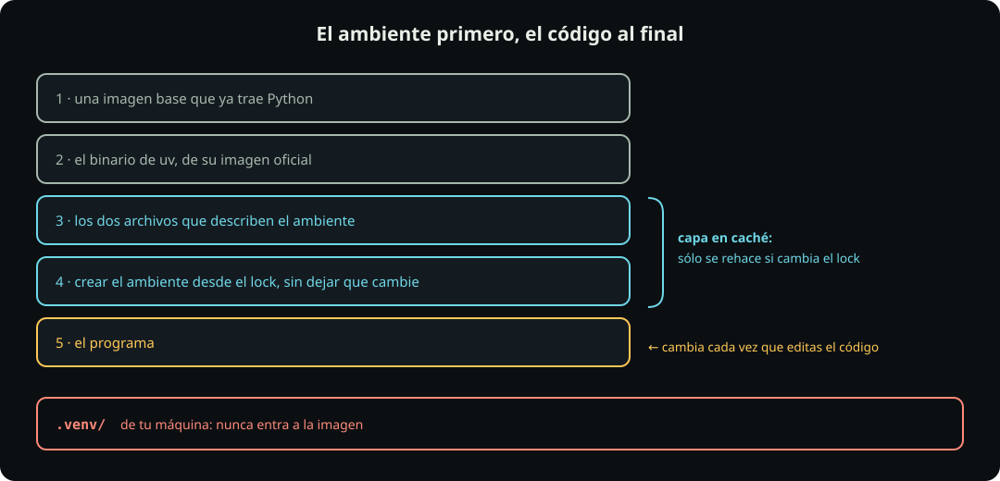

# Las entregas de ambientes

**Anexo B** · el tablero de la sección

Dos entregas, las dos por pull request. Esta página es la versión en tabla de lo que dice cada objeto oficial: **el contrato manda**.

::: table {#py-entregas-resumen title="Las dos entregas de ambientes"}

| # | Entrega | Vence | Vale | Branch | Carpeta |
|---:|---|---|---:|---|---|
| 1 | DataCamp: *Introduction to Python for Developers* | 2026-10-06 | 10 | `tarea-09-datacamp-python` | `python/` |
| 2 | Tu ambiente uv dentro de Docker | 2026-10-06 | 10 | `tarea-09-uv-docker` | `09_python/uv_docker/` |

:::

**Dos carpetas, dos branches, dos pull requests**, las dos branches nacidas de `main` y ninguna de la otra. El error que más se va a repetir: la de DataCamp es `python/`, **sin** número; la de Docker es `09_python/`, **con** el cero.

Se entrega tarde con un punto menos por día, contando el día en que entregas.

## 1 · DataCamp: Introduction to Python for Developers

| | |
|---|---|
| **Vence** | 2026-10-06 |
| **Vale** | 10 puntos |
| **Branch** | `tarea-09-datacamp-python` |
| **Carpeta** | `estudiantes/<tu-login>/python/` |

**Entregas dos archivos**

- `certificaciones.md` con sus tres secciones llenas: quién eres; la fecha en que lo terminaste, **en formato `AAAA-MM-DD`**, y la **URL del Statement of Accomplishment**; y una cosa concreta que aprendiste.
- `introduccion-python-developers.png`: el curso terminado, con **tu nombre y el 100 % visibles**. Con ese nombre exacto, porque la plantilla ya lo enlaza.

**El ritual**

```bash
git switch main && git fetch upstream && git merge upstream/main
git switch -c tarea-09-datacamp-python
mkdir -p estudiantes/$GHUSER/python
cp -r codigo/python/. estudiantes/$GHUSER/python/
#   ... llenas certificaciones.md y guardas la captura ...
git add estudiantes/$GHUSER/python
git commit -m "unidad 09: DataCamp Introduction to Python for Developers"
git push -u origin tarea-09-datacamp-python
```

**No se entrega** un certificado suelto ni la captura de un ejercicio: la captura es la página del curso terminado.

**Acabaste cuando** el pull request está abierto y su revisión en verde. Si no terminaste el curso, sube lo que sí hiciste y dilo en el archivo.

## 2 · Tu ambiente uv dentro de Docker

| | |
|---|---|
| **Vence** | 2026-10-06 |
| **Vale** | 10 puntos |
| **Branch** | `tarea-09-uv-docker` |
| **Carpeta** | `estudiantes/<tu-login>/09_python/uv_docker/` |

Un programa que reporta su propio ambiente. Lo corres en tu máquina y dentro de un contenedor, y explicas qué salió igual y qué no.



**Entregas seis archivos**, todos dentro de `uv_docker/`:

| Archivo | Qué debe tener |
|---|---|
| `reporte.py` | Tu fila en `fila_propia()`, usando un paquete que tú elegiste |
| `pyproject.toml` | `rich` y tu paquete, agregado con uv |
| `uv.lock` | El que genera uv. Nunca a mano |
| `Dockerfile` | Los tres huecos llenos, en el orden de la figura |
| `.dockerignore` | La línea que deja fuera tu ambiente local. La plantilla no la trae a propósito |
| `bitacora.md` | Todas sus secciones llenas |

**El ritual**

```bash
git switch main && git fetch upstream && git merge upstream/main
git switch -c tarea-09-uv-docker
mkdir -p estudiantes/$GHUSER/09_python/uv_docker
cp -r codigo/09_python/uv_docker/. estudiantes/$GHUSER/09_python/uv_docker/
cd estudiantes/$GHUSER/09_python/uv_docker
```

**Los pasos**, cada uno con lo que ya viste en [[lab-uv]] y en la unidad 8:

1. `uv add <tu-paquete>`: escribe `pyproject.toml`, genera `uv.lock` y crea `.venv/`.
2. Escribe tu fila en `reporte.py` y córrela: `uv run reporte.py`. Pega la salida en la bitácora.
3. Llena los tres huecos del `Dockerfile` y la línea de `.dockerignore`.
4. Construye para la arquitectura del revisor: `docker buildx build --platform linux/amd64 -t <tu-usuario>/reporte .`
5. Córrela: `docker run --rm <tu-usuario>/reporte`. Pega la salida en la bitácora.
6. Publícala: `docker push <tu-usuario>/reporte`.
7. La prueba, en este orden: `docker logout`, `docker rmi -f <tu-usuario>/reporte`, `docker run --rm <tu-usuario>/reporte`.

```bash
cd ~/fdd/fdd_o26
git add estudiantes/$GHUSER/09_python/uv_docker
git status        # .venv/ NO debe aparecer
git commit -m "unidad 09: mi ambiente uv en Docker"
git push -u origin tarea-09-uv-docker
```

**No se entrega**: `.venv/`, `__pycache__/`, la imagen como archivo, ni la salida de `docker login`. Tampoco nada de `ambientes/`: los labs viven fuera del repo.

**Tres cosas que se rompen**

| Qué haces | Qué pasa |
|---|---|
| Construyes en Apple Silicon sin `--platform linux/amd64` | La imagen corre en tu Mac y en la del revisor no |
| Copias todo el proyecto a la imagen sin excluir tu `.venv/` | Truena al correr (salida real, abajo) |
| Cambias `pyproject.toml` y no regeneras el lock | La construcción falla: `The lockfile at uv.lock needs to be updated` |

Lo que sale cuando tu `.venv/` local entra a la imagen:

```text
warning: Ignoring existing virtual environment linked to non-existent Python interpreter
Removed virtual environment at: .venv
Creating virtual environment at: .venv
Traceback (most recent call last):
  File "/app/reporte.py", line 10, in <module>
    import humanize
ModuleNotFoundError: No module named 'humanize'
```

La URL que sirve es la pública, `hub.docker.com/r/<tu-usuario>/reporte`; la de tu panel (`/repository/…`) da 404 a los demás. Ábrela en una ventana privada.

**Acabaste cuando** el pull request está abierto, su revisión en verde, y tu imagen se baja y corre en una máquina que no es la tuya.

## Qué revisa la revisión automática

| Revisa | No revisa (lo reviso yo) |
|---|---|
| Que estén los archivos y la captura, con su nombre | Que la captura sea tuya y de este curso |
| Que las secciones estén llenas; fecha `AAAA-MM-DD`; URL presente | Que la URL abra tu certificado |
| Los tres huecos llenos; el ambiente creado sin dejar que el lock cambie | Que la imagen exista y corra |
| `.venv` en `.dockerignore`; tu fila; dos dependencias; `rich` en el lock | Que las salidas pegadas salgan de tu imagen y coincidan con tu lock |
| URL pública; prueba con `Unable to find image` y `Pulling from`; sin `Login Succeeded` | Lo que debes poder explicar sin ayuda |

Los mensajes dicen **qué** está mal, **por qué** importa y **dónde investigar**; no dicen cómo arreglarlo.
