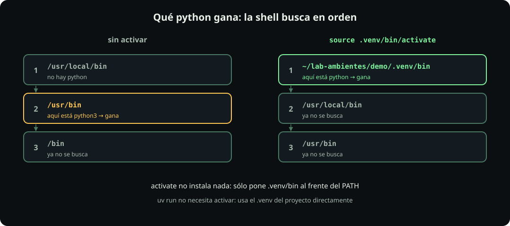

# Un ambiente por dentro

**Página 3 de 10 · Ambientes**

Meta: comprobar con tres comandos qué es un ambiente y qué hace «activar».

::: figure {#py-venv-arbol title="Un ambiente es una carpeta"}

:::

## En corto

- **Un ambiente es una carpeta**, normalmente `.venv/`, dentro de tu proyecto.
- Trae **su propio `python` y su propio `site-packages/`**.
- **Activar sólo cambia el `PATH`**. Con `uv run` no hace falta activar.

## Prepara un proyecto

**Haz:**

```bash
cd ~/fdd/fdd_o26/estudiantes/$GHUSER/09_python/ambientes
uv init --no-package hola && cd hola
uv add rich
```

**Deberías ver:** (las versiones pueden ser más nuevas)

```text
Initialized project `hola` at `/home/ana/fdd/fdd_o26/estudiantes/ana/09_python/ambientes/hola`
Using CPython 3.13.15 interpreter at: /usr/local/bin/python3.13
Creating virtual environment at: .venv
Resolved 5 packages in 455ms
 + markdown-it-py==4.2.0
 + mdurl==0.1.2
 + pygments==2.21.0
 + rich==15.0.0
```

`uv add` creó `.venv/` sin que se lo pidieras. Pediste un paquete e instaló cuatro: `rich` necesita a los otros tres.

## Hechos 1 y 2: una carpeta con su python

**Haz:**

```bash
ls -a .venv
cat .venv/pyvenv.cfg
ls .venv/lib/python3.*/site-packages/ | head
```

**Deberías ver:**

```text
.  ..  .gitignore  .lock  CACHEDIR.TAG  bin  lib  lib64  pyvenv.cfg

home = /usr/local/bin
implementation = CPython
uv = 0.12.21
version_info = 3.13.15
include-system-site-packages = false

_virtualenv.pth  _virtualenv.py  markdown_it  mdurl  pygments  rich  …
```

- `bin/python` es el intérprete del ambiente: un enlace al Python que dice `home`.
- `site-packages/` tiene **sólo** lo que instalaste aquí: `rich` y sus tres dependencias.
- `include-system-site-packages = false`: este ambiente no ve los paquetes del sistema.
- `lib64` sólo aparece en Linux; en macOS no está.
- En Windows: `.venv\Scripts\` en vez de `bin/`, y `.venv\Lib\site-packages\`.

## Hecho 3: activar cambia el PATH

::: figure {#py-path title="Qué python gana: la shell busca en orden"}

:::

**Haz:** corre `quien_soy.py` de tres maneras.

```bash
cp ../quien_soy.py .
python3 quien_soy.py              # 1. sin activar
source .venv/bin/activate         # Linux y macOS
python quien_soy.py               # 2. activado
deactivate
uv run quien_soy.py               # 3. sin activar, con uv run
```

En Windows (PowerShell), el paso de activar es:

```powershell
.venv\Scripts\activate
```

**Deberías ver:** cambian cuatro líneas.

| Línea | 1. sin activar | 2. activado | 3. `uv run` |
|---|---|---|---|
| `python que corre` | `/usr/local/bin/python3` | `…/hola/.venv/bin/python` | `…/hola/.venv/bin/python` |
| `sys.prefix` | `/usr/local` | `…/hola/.venv` | `…/hola/.venv` |
| `¿en un ambiente?` | `no` | `sí` | `sí` |
| `rich` | `NO instalado en este Python` | `instalado, versión 15.0.0` | `instalado, versión 15.0.0` |

La columna 1 es la del Python de tu sistema: en tu máquina puede decir `/usr/bin/python3` o `/opt/homebrew/bin/python3`. Lo que importa es que **no** es `.venv`.

## Lo que de verdad hace activate

**Haz:**

```bash
echo $PATH | tr ':' '\n' | head -2
source .venv/bin/activate
echo $PATH | tr ':' '\n' | head -2
deactivate
```

**Deberías ver:** la primera carpeta cambia.

```text
/usr/local/bin
/usr/local/sbin
/home/ana/fdd/fdd_o26/estudiantes/ana/09_python/ambientes/hola/.venv/bin
/usr/local/bin
```

- `activate` **no instala ni copia nada**: sólo cambia en qué orden la shell busca `python`.
- `uv run` usa el `.venv/` del proyecto **sin tocar tu shell**. Por eso en este curso no hace falta activar.

::: problem {#py-activado title="¿Dónde quedó rich?"}
Abres una terminal nueva, entras a `estudiantes/<tu-login>/09_python/ambientes/hola` y corres `python hola.py`. Sale `ModuleNotFoundError: No module named 'rich'`. Ayer funcionaba. ¿Qué pasó?
:::

::: hint {of="py-activado"}
¿Qué te diría `quien_soy.py` en esa terminal nueva?
:::

::: answer {of="py-activado"}
- La terminal nueva no está activada: `python` es el del sistema, que no tiene `rich`.
- `rich` sigue en `.venv/`; no se borró nada.
- Arreglo: `uv run hola.py`, o activar primero.
:::

Sigue con [[los-archivos-del-ambiente]]: qué archivos describen un ambiente y cuáles van a git.

> [!NOTE]
> **Si sólo recuerdas una cosa:** un ambiente es una carpeta con su propio python; activar sólo cambia cuál python encuentra tu shell.
