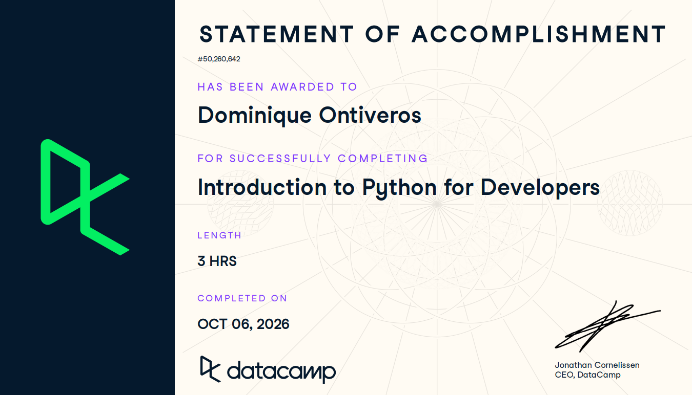

# Certificaciones de Python

Llena este archivo en **tu copia**, dentro de `estudiantes/<tu-login>/python/`.

## Quién soy

- Usuario de GitHub: Domdimad0m 
- Usuario de DataCamp: dontive1@itam.mx

El repositorio es público: no escribas aquí tu nombre completo ni tu correo.

## Introduction to Python for Developers

Fecha en que lo terminaste (AAAA-MM-DD): 2026-10-05

URL del Statement of Accomplishment: https://www.datacamp.com/completed/statement-of-accomplishment/course/725cead0d0da9095e48dcef334216b39228475ea 

## Una cosa que aprendiste y no sabías

Solo se reforzó los conceptos y la sintaxis de varios comandos. No hubo como tal aprendizajes nuevos pero sí una recapitulación de como funcionan las estructuras básicas en python.

