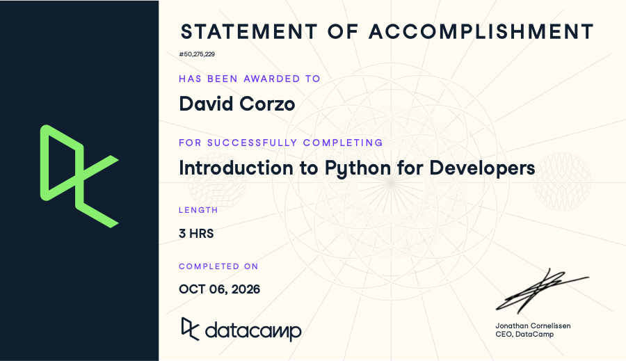

# Certificaciones de Python

Llena este archivo en **tu copia**, dentro de `estudiantes/<tu-login>/python/`.

## Quién soy

- Usuario de GitHub: dacorzo
- Usuario de DataCamp: David Corzo

El repositorio es público: no escribas aquí tu nombre completo ni tu correo.

## Introduction to Python for Developers

Fecha en que lo terminaste (AAAA-MM-DD): 2026-10-06

URL del Statement of Accomplishment: https://www.datacamp.com/completed/statement-of-accomplishment/course/da38885a4bae89b41a439aa6d194ad21dbd6b769

## Una cosa que aprendiste y no sabías

Se llena en esta entrega. Dos o tres líneas: algo concreto del curso que no
sabías, o que tenías a medias y ahí se te acomodó.
En general creo que tenía un buen dominio de Python, pero creo que me sirvió como una buena refrescada. Me ayudó sobre todo recordar cómo lidiar con loops y distintos data types (por ejemplo, diccionarios y tuplas).
