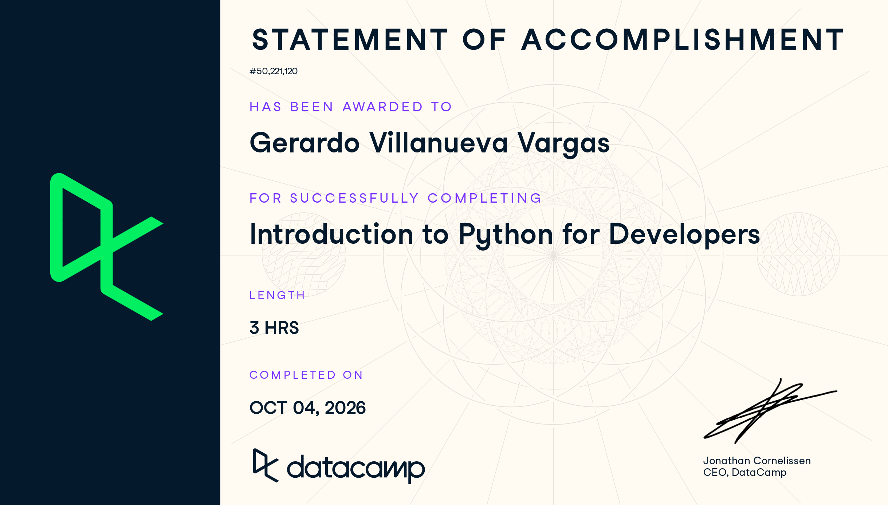

# Certificaciones de Python

Llena este archivo en **tu copia**, dentro de `estudiantes/<tu-login>/python/`.

## Quién soy

- Usuario de GitHub:geraVillV
- Usuario de DataCamp: Gerardo

El repositorio es público: no escribas aquí tu nombre completo ni tu correo.

## Introduction to Python for Developers

Fecha en que lo terminaste (AAAA-MM-DD): 2026-10-03

URL del Statement of Accomplishment: https://www.datacamp.com/completed/statement-of-accomplishment/course/48133bc1445c2955653bbdb7dade81b35a822c74?utm_medium=organic_social&utm_campaign=sharewidget&utm_content=soa

## Una cosa que aprendiste y no sabías

Algo que tenia a medias era lo de como recorrer diccionarios. De igual forma hace rato no programaba en python por lo que fue util volver a repasar todos los conceptos de listas, tuplas, conjuntos, diccionarios, etc.
