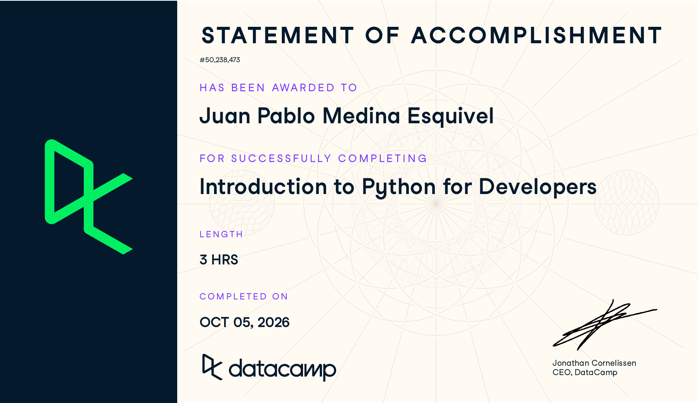

# Certificaciones de Python

Llena este archivo en **tu copia**, dentro de `estudiantes/<tu-login>/python/`.

## Quién soy

- Usuario de GitHub:jpmedinae
- Usuario de DataCamp:jpmedinae

El repositorio es público: no escribas aquí tu nombre completo ni tu correo.

## Introduction to Python for Developers

Fecha en que lo terminaste (AAAA-MM-DD):2026-10-05

URL del Statement of Accomplishment:https://www.datacamp.com/completed/statement-of-accomplishment/course/e3bba6c064f70cffec1a4dbb356500be79c09b72

## Una cosa que aprendiste y no sabías

Se llena en esta entrega. Dos o tres líneas: algo concreto del curso que no
sabías, o que tenías a medias y ahí se te acomodó.

La verdad sabía todo. EL curso es muy básico.
