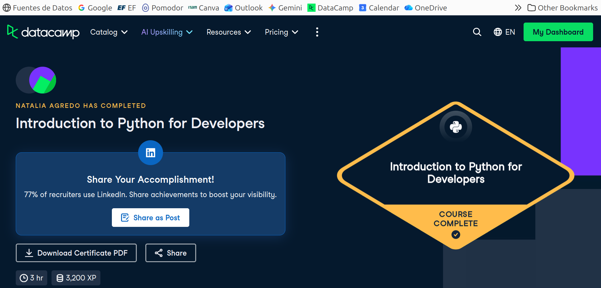

# Certificaciones de Python

Llena este archivo en **tu copia**, dentro de `estudiantes/<tu-login>/python/`.

## Quién soy

- Usuario de GitHub: nat-aglo
- Usuario de DataCamp: Natalia Agredo

El repositorio es público: no escribas aquí tu nombre completo ni tu correo.

## Introduction to Python for Developers

Fecha en que lo terminaste (AAAA-MM-DD):2026-10-05

URL del Statement of Accomplishment:https://www.datacamp.com/completed/statement-of-accomplishment/course/87d1ca1ba4999cbb3d4143ab1f33f7d7614564f8

## Una cosa que aprendiste y no sabías

Se llena en esta entrega. Dos o tres líneas: algo concreto del curso que no
sabías, o que tenías a medias y ahí se te acomodó.
Soy del plan anterior, no lleve python pero me obligo Estructuras de Datos Avanzadas a aprender algo. Lo que mas me intereso aprender fue 
diccionarios. No sabia que se podia acceder por separado al valor y al key, ni mucho menos como acceder a ellos en loops. Fue facil el curso, 
pero me agrado.
